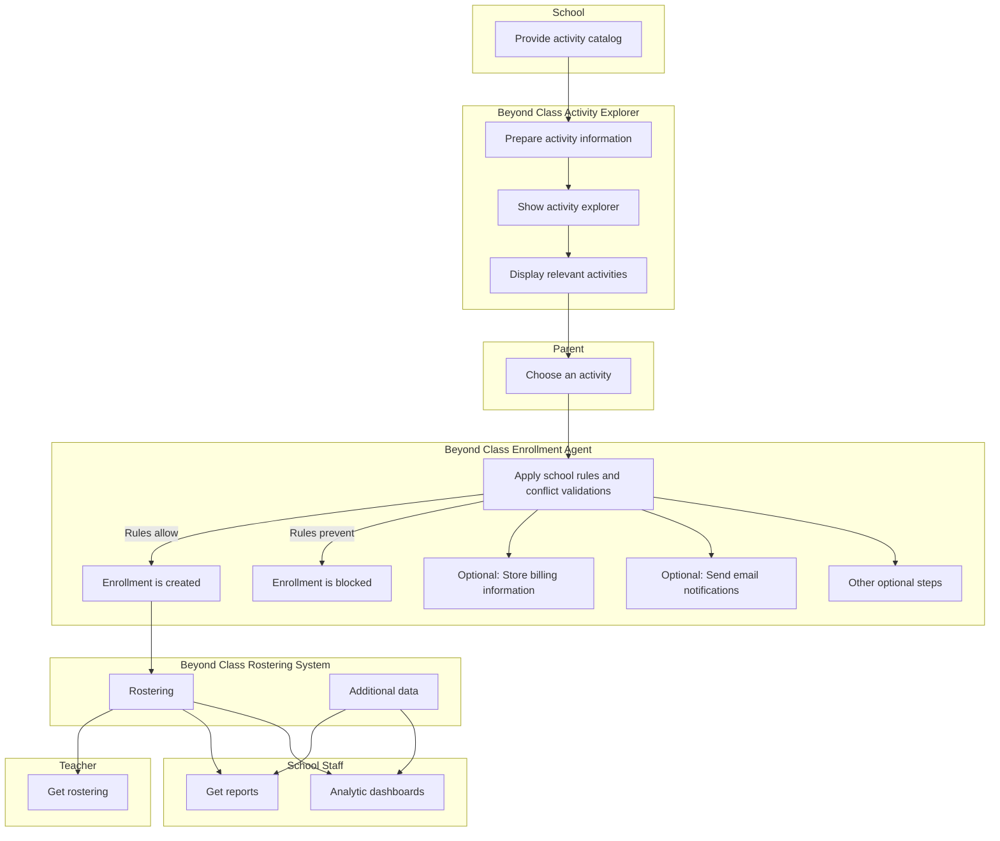
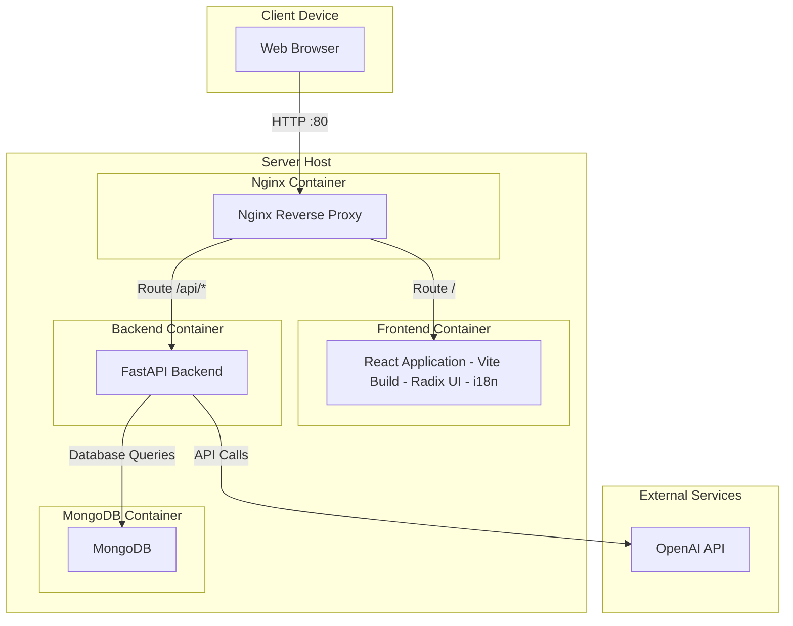

# Beyond Class

**Beyond Class** is an agentic AI application that helps K–12 schools manage extracurricular activities with clarity, consistency, and flexibility. The system transforms the school’s activity catalog into a searchable experience for families, orchestrates enrollment through modular agent workflows, maintains accurate rosters for teachers, and provides analytics for school staff.

The application is organized into four functional modules:

1. **Activity Explorer**  
2. **Enrollment**  
3. **Rostering**  
4. **Analytics**

Each module plays a distinct role in the overall experience, and agentic orchestration allows schools to adapt workflows using natural‑language instructions rather than code.

## Functional View 

Beyond Class provides:

- AI‑powered activity exploration  
- modular enrollment orchestration  
- conditional rule‑based validation  
- optional workflow steps 
- automated rostering  
- teacher tools
- analytics dashboards
- semantic search and multilingual support  
- natural‑language configuration

  It is a flexible, agent‑driven platform that adapts to each school’s policies and simplifies the management of extracurricular activities.

---
### Pipeline

### 1. Activity Explorer Module

The Activity Explorer guides families from the school’s catalog to selecting an activity for their child.

#### Catalog Intake
Schools provide a **PDF activity catalog** that follows basic content‑quality guidelines (clear titles, descriptions, schedules, and categories).  
Beyond Class does **not** rewrite or standardize this content.  
AI agents extract the information as provided and load it into a vector database.

#### AI Preparation
AI agents:

- extract text  
- translate content  
- index the catalog semantically  

This creates a multilingual, searchable knowledge base.

#### Parent Access
Parents sign in using:

- **Gmail**, or  
- **Microsoft accounts**

No new passwords are required.

#### Student Context
Beyond Class retrieves the parent’s dependents from the **Student Information System (SIS)**.  
The parent selects one student.

#### Activity Discovery
The system displays activities relevant to the selected student through:

- grade‑level filtering  
- keyword filtering  
- semantic search powered by RAG  

Parents explore the catalog and choose an activity.

---

### 2. Enrollment Module

Once a parent chooses an activity, Beyond Class triggers the Enrollment Module, which is orchestrated by an agent using modular, configurable steps.

#### School Rules and Validations
The Enrollment Agent applies school rules such as:

- scheduling conflict checks  
- grade restrictions  
- prerequisite requirements  

These rules can prevent enrollment.

#### Conditional Enrollment
If school rules allow it, the agent creates the enrollment.  
If rules prevent it, the enrollment is blocked.

#### Optional Steps
The Enrollment Agent may also execute optional steps such as:

- storing billing information  
- sending email notifications  
- other school‑defined actions  

These steps are **Lego‑like bricks** that can be added, removed, or reordered without changing the underlying code.

---

### 3. Rostering Module

When enrollment is created, Beyond Class updates the **Rostering Module**, which maintains:

- student rosters  
- activity assignments  
- additional data needed for teachers and staff

#### Teacher Tools
Teachers access real‑time rosters to manage attendance and activity participation.

---

### 4. Analytics Module

School staff access consolidated information through:

- reports  
- analytic dashboards  
- additional data from the rostering system

These tools provide visibility into enrollment trends, participation, and operational needs.

---

## Deployment Diagram (In progress)
 

## Run the server 

<RootFolder>/backend 
