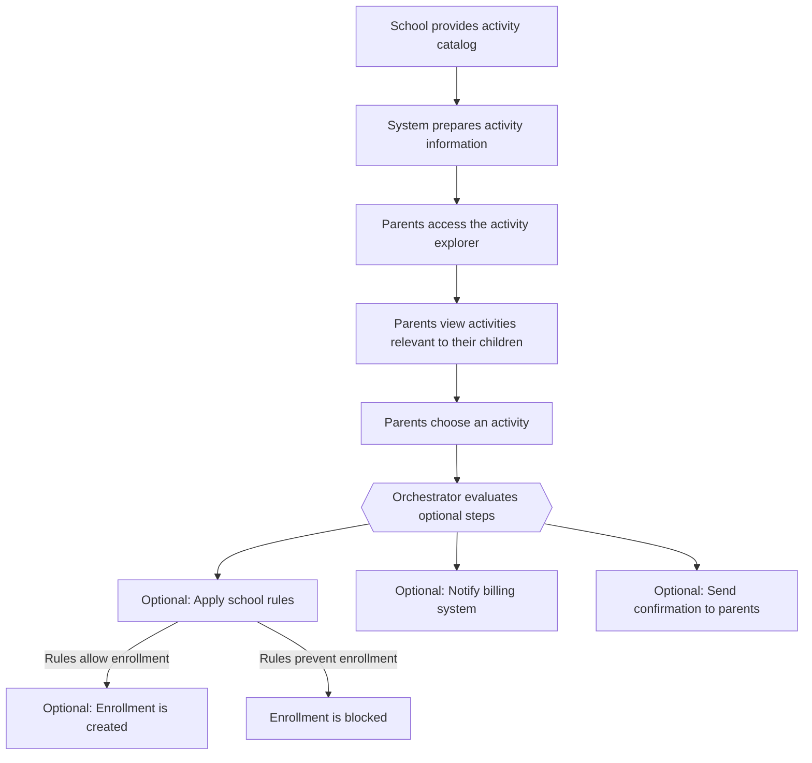

# Beyond Class

Beyond Class is an agentic AI application designed to help K–12 schools manage extracurricular activities with greater efficiency, consistency, and adaptability. The system uses natural language processing, semantic search, and modular agentic workflows to streamline activity exploration, enrollment, rostering, attendance, communication, and reporting.

## Pipeline

flowchart TD

    %% Client Layer
    A[Browser\nParent URL / Role-based URL] --> B[Nginx Reverse Proxy]

    %% Nginx Routing
    B -->|"/"| C[Frontend\nReact + Vite + i18n]
    B -->|"/api/*"| D[Backend\nFastAPI (Python)]

    %% Backend Connections
    D --> E[MongoDB\nUsers + Students]
    D --> F[OpenAI API]

    %% Notes
    C -->|Fetch languages, users, students| D

Deployment Diagram

flowchart TB

    %% Deployment Nodes
    subgraph Client_Device[Client Device]
        Browser[Web Browser]
    end

    subgraph Server_Host[Server Host / VM / Container Host]
        subgraph Nginx_Container[Nginx Container]
            Nginx[Nginx Reverse Proxy]
        end

        subgraph Frontend_Container[Frontend Container]
            FE[React Application\n(Vite Build)]
        end

        subgraph Backend_Container[Backend Container]
            BE[FastAPI Backend\n(Python)]
        end

        subgraph Mongo_Container[MongoDB Container]
            DB[(MongoDB\nUsers + Students)]
        end
    end

    subgraph External_Services[External Services]
        OpenAI[OpenAI API]
    end

    %% Connections
    Browser -->|HTTP :80| Nginx
    Nginx -->|Route "/"| FE
    Nginx -->|Route "/api/*"| BE
    BE -->|Database Queries| DB
    BE -->|API Calls| OpenAI

## Run the server 

<RootFolder>/backend 
